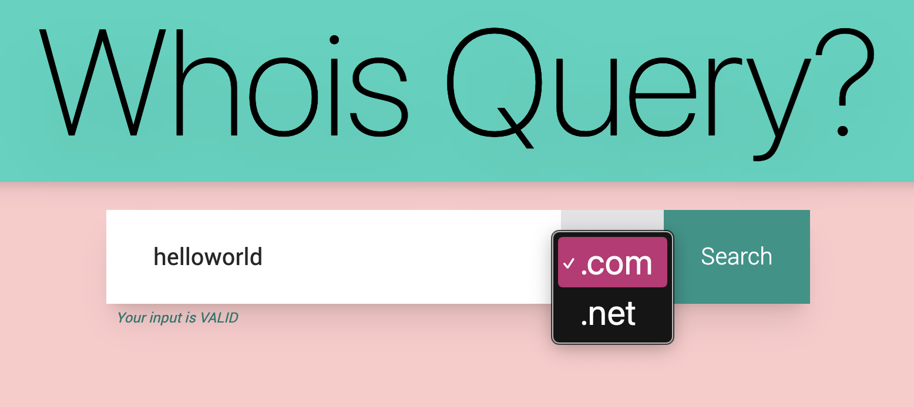
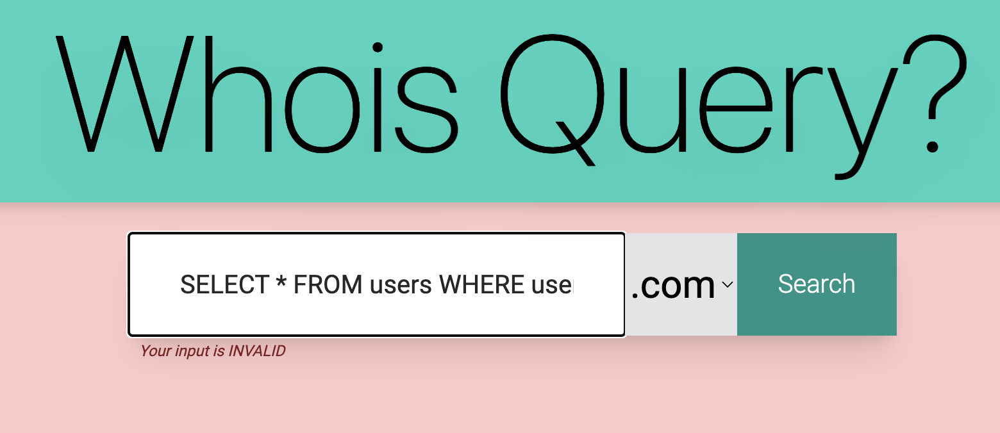
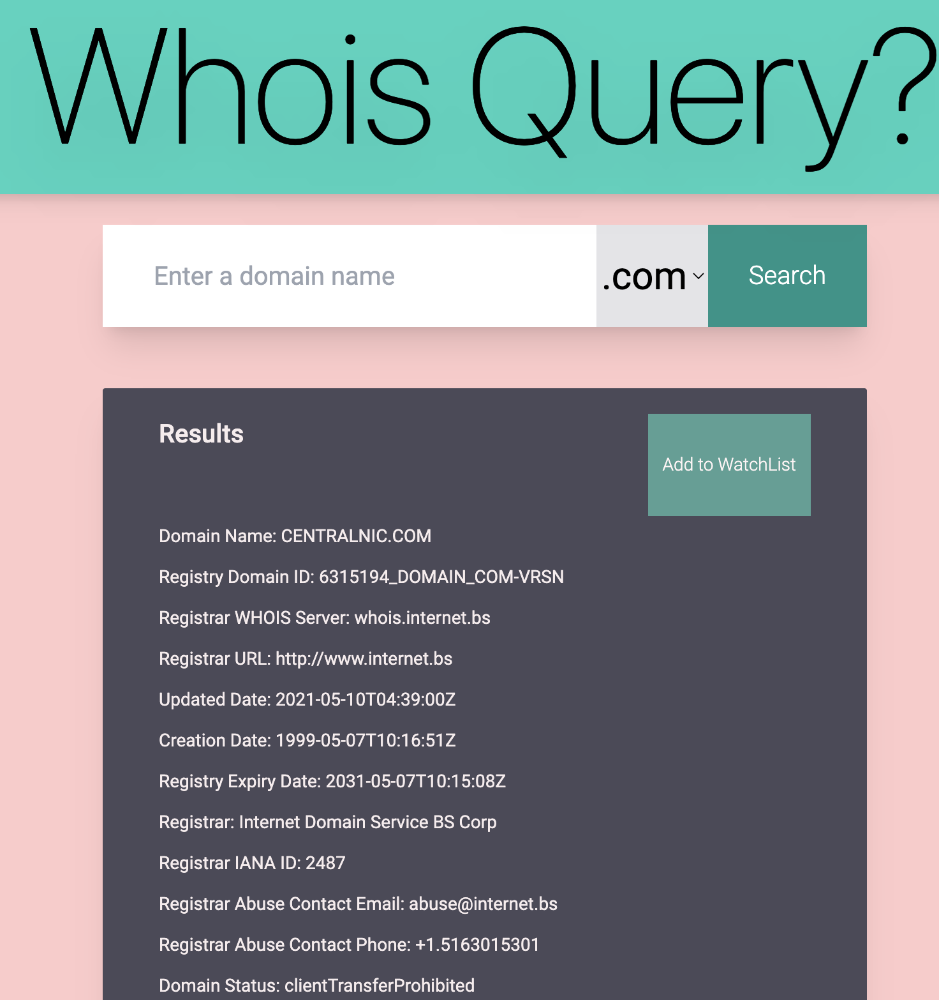
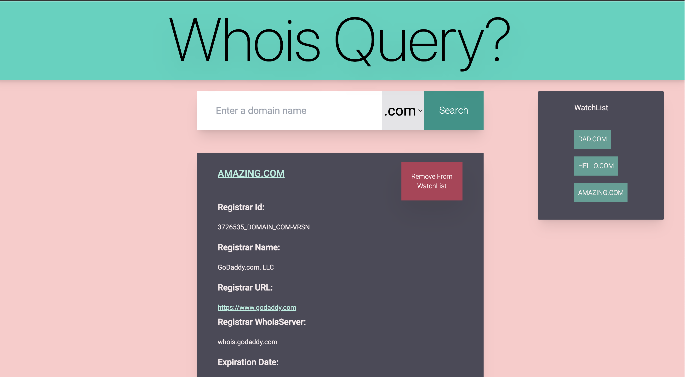

# whois-monorepo

[](https://www.codefactor.io/repository/github/noelcv/whois-query-fe)

Repository of a fullstack [WhoisQuery](https://whois-monorepo-client.vercel.app) Application. Originally split into two separate microservices, Whois-Monorepo brings together in one Monolith both backend (server) and frontend (client).



## Frontend Tech-Stack Overview

<p align="left">
<a href="https://www.typescriptlang.org/" target="_blank" rel="noreferrer"></a> 
<a href="https://angular.io/" target="_blank" rel="noreferrer"></a> 
<a href="https://ngrx.io/"></a> 
<a href="https://tailwindcss.com/" target="_blank" rel="noreferrer"></a>
<br> 


## Backend Tech-Stack

<a href="https://www.typescriptlang.org/" target="_blank" rel="noreferrer"></a>
<a href="https://nodejs.org/en/" target="_blank" rel="noreferrer"></a>
<a href="https://expressjs.com/" target="_blank" rel="noreferrer"></a>
<a href="https://www.mongodb.com/" target="_blank" rel="noreferrer"></a>
</p>

## CI/CD Layer

<div style="border: 1px solid">
<a href="https://github.com/actions/" target="_blank" rel="noreferrer"></a>
<a href="https://www.render.com/" target="_blank" rel="noreferrer"></a><a href="https://www.vercel.com" target="_blank" rel="noreferrer"><svg width="36" height="35"  viewBox="0 0 76 65" fill="none" xmlns="http://www.w3.org/2000/svg"><path d="M37.5274 0L75.0548 65H0L37.5274 0Z" fill="#ffffff"/></svg></a>
<a href="https://eslint.org/" target="_blank" rel="noreferrer"></a> 
<a href="https://prettier.io/" target="_blank" rel="noreferrer"></a>
<a href="https://typicode.github.io/husky/" target="_blank" style="width: 36px; height: 36px" rel="noreferrer">🐶 husky</a>
<a href="https://github.com/okonet/lint-staged" target="_blank" style="width: 36px; height: 36px" rel="noreferrer">🚫💩 lint-staged</a>
</div>
</p>

## State Management

To make the app truly reactive and ready to be manageable at scale, we opted to manage the state with **NgRx** and recreate Redux-like Patterns to establish a single source of truth to manage the interactions on the client-side.

🗃 STORE  
|**_ state  
|_** actions  
|**_ reducers  
|_** effects  
|\_\_\_ selectors

## Modularity and Composability

We procured to keep the code modular, the functions pure and keep side effects to the bare minimum.

Example given, instead of chaining multiple actions within an effect, we opted to draft highly targeted action collections, with a tight scope of execution, that can be atomically actionable and dispatchable as needed from the UI.

- Domain Actions - for API interactions
- UI Actions - for User Interface / User Experience interactions and affordances (e.g: display/hide results, provide validation feedback on user input, etc.)
- WatchList (for additional Ui filtering and scope management)

## CI/CD

Add ESLint (linting), Prettier (code-formatting), Husky (for git hooks - pre-commit and pre-push) and Lint-Staged (for running linting only on staged files)

## Tailwind

For styling our UI, we opted for TailwindCSS, not only for allowing for fast prototyping, but also for the optimized CSS builds, which are significantly smaller than regular CSS.

## Security

## Security considerations

### No external libraries to perform Whois queries

To reduce vulnerabilities associated with external dependencies in the core service of the application, we relied solely on the default NET module from NodeJS, which provides an asynchronous network API for creating stream-based TCP servers.

### CORS Policy

We define environment variables for allowedOrigins and pass them as options on CORS middleware to verify the requests are coming from trusted origins.

On Render, we safely store those environment variables to be accessed in PRODUCTION.

Moreover, we also define the HTTP Request methods to be allowed - for now, only GET requests are allowed, given that we are only storing queries logs on the database.

### Security Middleware and Server-side sanitization

Using helmet as Middleware to set custom headers, we define custom security policies to reduce the surface and preventing against MIME-Type sniffing, Man-in-the-Middle and XSS-Cross Site Scripting attacks.

We also validate the query parameters from the client against REGEX patterns to match the following conditions: 
    - The domain name shall have between 1 and 63 characters.
    - Only alphanumeric characters and hiffens (-) are acceptable.
    - Period (.) signs are allowed as long as they are not placed neither at the beginning nor at the end of the SLD. Also, we implemented sanitization against having two dots in a row;
    - Parallel validation of the Top-Level Domains against the list of supported TLD by the application.

### Semantic Error Handling

All the controllers provide consistent error handling, using try/catch blocks, with semantical comments both for guidance over development, but also to provide contextual feedback to enhance the UX / UI, without exposing sensible information on the App architecture.

### Client-side input sanitization

```jsx

```

Although the core of the data validation strategy occurs on the server-side, we still implemented client-side validation on Reactive Forms and disable submission when forbidden characters or missing fields are missing.

Naturally, this doesn't prevent curl / Man-in-the-middle or XSS attacks by itself, but our production environments count with SSL encryption, and we also besides have server-side validation and CORS Policies.

### Credential and Personally Identifiable Information (PII)

Although we are not dealing with highly-sensitive information (such as passwords, credit card details, etc), we procured to prevent browser caching of user inputs by setting HTML attributes to override the default configuration.

```jsx
    <input formControlName="sldInput" class="w-3/4 h-20 text-xl p-10" type="text" placeholder="Enter a domain name" type="text" min-length="1" maxlength="63" spellcheck="false" autocomplete="off" autocorrect="off" autocapitalize="off">>
```

### Separation of Concerns

In order to keep the codebase clean and maintainable, we followed separation of concerns conventions and keep separate folders and files for Controllers, Models, Utils and Configurations.

## Deployment

Backend: Render.com

Front-End: Vercel

## Dependabot

Enable automatic package management with dependabot.

```yml
version: 2
updates:
  - package-ecosystem: 'npm'
    directory: '/'
    schedule:
      interval: 'daily'
    allow:
      # to distinguish between development and production environments
      - dependency-type: 'production'
    ignore:
      # dependencies listed here will be ignored
      - dependency-name: '@angular-devkit/build-angular'
```

## Roadmap

As further steps, I would refine the following steps:

📌 Implement JWT
📌 Expand ErrorBoundaries and Pending / Loading responses  
📌 Expand Test suite  
📌 Responsive Design: Elaborate on media queries for adaptive breakpoint layouts.  
📌 Further CRUD operations for data persistance of the user's watchlist options.
📌 Remap the whois lookup to an Interface on the server-side

## Other considerations

Currently the API request is returning a raw response, which corresponds to an interface IDomainResult that is used for the first load.



Once the user adds a domain to the WatchList, once he clicks it, the response is than parsed to a "prettified" version with a selection of relevant fields from the Whois Query.


